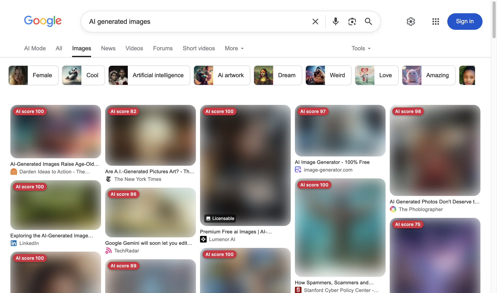

# Blur

Blur is a privacy-preserving Manifest V3 Chrome extension that identifies AI-generated images directly in the browser. It never sends images, URLs, or inference results to the developer or an inference service.

## Results at a glance

All labeled results below use the bounty rule unchanged: **AI when score ≥ 0.65**. The broad frozen test contains 500 real bases from three acquisition sources and 552 AI bases from three unseen generator families; none were used to train, calibrate, or select the production checkpoint.

| Evaluation | Balanced accuracy | AI recall | Real recall | Confusion counts |
|---|---:|---:|---:|---:|
| **Broad frozen full resolution (1,052 bases), deployed Chrome/WebGPU** | **95.6%** | **92.4%** | **98.8%** | **TP 510 · FN 42 · TN 494 · FP 6** |
| Small protected full-resolution diagnostic (64 bases), deployed Chrome/WebGPU | 98.4% | 96.9% | 100% | TP 31 · FN 1 · TN 32 · FP 0 |
| Broad frozen 256 px / JPEG 75 (1,037 bases), deployed Chrome/WebGPU | 67.1% | 39.7% | 94.4% | TP 219 · FN 333 · TN 458 · FP 27 |
| Protected 192 px / JPEG 50 diagnostic (64 bases), reference scorer | 59.4% | 21.9% | 96.9% | TP 7 · FN 25 · TN 31 · FP 1 |

The first three rows exercise the production extension—fetch, browser decode, multi-crop aggregation, and evidence fusion—not just an offline model wrapper. The broad full-resolution result clears 95% balanced accuracy, but the broad thumbnail result does not: recompressed small images remain the detector's principal limitation. The fail-closed release gate therefore remains blocked. See the [broad frozen report](docs/results/frozen-broad.json), [small protected report](docs/results/deployed-full.json), and [`docs/BENCHMARK.md`](docs/BENCHMARK.md).

The clean Chrome Google Images smoke test shown below completed 47 local analyses with no inference errors: **39 met the AI threshold and were blurred; 8 remained below it**. Search results are not ground-truth labels, so this is product-behavior evidence rather than an accuracy claim.

## Features

- Automatically discovers responsive, lazy-loaded, and dynamically inserted webpage images.
- Displays an AI/real score on every analyzed image at the fixed 65% bounty threshold.
- Runs a pinned Community Forensics ViT-small detector with WebGPU and a WASM fallback.
- Inspects bounded JPEG, PNG, and WebP metadata as a conservative supporting signal.
- Bundles all inference code and model assets in the packaged extension.
- Uses no server, localhost process, external API, telemetry, or remote inference.

## Browser example



This screenshot comes from a clean Chrome-for-Testing profile loaded with the unpacked production build. A search result is a useful product smoke test, not a labeled accuracy benchmark.

## Architecture

- A content script discovers visible, lazy-loaded, and dynamically inserted images and displays scores.
- The service worker validates and routes bounded image-analysis requests to an extension-owned offscreen document.
- The offscreen document retrieves the selected webpage image bytes, inspects provenance metadata, and runs ONNX Runtime Web locally with WebGPU, falling back to WebAssembly.
- Inference assets are bundled with the extension. Runtime network access is used only to retrieve the webpage images selected for local analysis.

The upstream detector reports 89.3% mean per-generator accuracy on 21 held-out generators. That is upstream evidence, not a claim about the private bounty benchmark. See [Community Forensics](https://arxiv.org/abs/2411.04125) and the pinned model details in [`models/README.md`](models/README.md).

## Build

Prerequisites: Node.js 20 or newer.

```sh
npm ci
python3.11 -m venv .venv311
.venv311/bin/pip install -r tools/model-requirements.txt
npm run model:export
npm run model:verify
npm run verify
npm run package
```

Load `dist/` using **Chrome → Extensions → Developer mode → Load unpacked**.

The packaged artifact is `release/blur-chrome.zip`. The pinned production safetensors checkpoint is included in source; the generated ONNX file is intentionally excluded from Git. Their exact checksums are committed, and both export and build reject a mismatch.

`npm run package` creates an ordinary reproducible-build artifact for local review. `npm run package:release` is the fail-closed bounty release command and additionally requires the frozen deployed-path evidence described in [`docs/BENCHMARK.md`](docs/BENCHMARK.md).

## Privacy and offline verification

1. Build and load the extension in a clean Chrome profile.
2. Visit a test page once while online so its images are available.
3. Disable network access and block localhost.
4. Reload from browser cache or open a local fixture page.
5. Confirm scores are produced without any inference-related request.

## Verification performed

- TypeScript, ESLint, and unit tests pass.
- ONNX graph validation passes.
- PyTorch-to-ONNX logit parity passes with maximum absolute error `4.649162292480469e-06` on the current checked model.
- A clean-profile Chrome for Testing smoke test produces an on-page score using WebGPU.
- The same smoke test with GPU disabled produces an on-page score using WASM.
- Chrome accepts and packs the MV3 manifest.

On one Apple Silicon macOS test machine, a fresh-profile WebGPU case took 352.7 ms through the inference pipeline (48.8 ms inference), while a fresh-profile GPU-disabled WASM case took 905.5 ms (595 ms inference). Across 64 WebGPU cases in bounded 48-image waves, warm uncached p50/p95 inference was 47.8/51.3 ms and per-job end-to-end pipeline time was 69.8/84.6 ms; request-to-DOM wall time including queueing was 717.9/1,774.6 ms. A separate 64-image WASM run still completed 64/64 after the extension service worker was terminated mid-run. These engineering measurements are machine- and workload-specific, not universal performance guarantees. Chrome was launched with external DNS blocked, and the scorer observed zero unexpected requests in its page-target network trace; the trace complements, but does not replace, process- or OS-level network blocking for offline verification.

## Limitations

The badge is an **AI evidence score**, not a calibrated probability. A score below 65 means only that the current detector did not reach the blur threshold; it is not proof that an image is real. Recompression, thumbnails, screenshots, novel generators, illustrations, CGI, and partial AI edits can produce false positives or false negatives. Unsigned metadata is never treated as proof, and missing provenance is never treated as evidence that an image is real.

See [`docs/COMPLIANCE.md`](docs/COMPLIANCE.md) and [`PRIVACY.md`](PRIVACY.md).

## License

[MIT](LICENSE). Required runtime and model attributions are recorded in [`THIRD_PARTY_NOTICES.md`](THIRD_PARTY_NOTICES.md).
